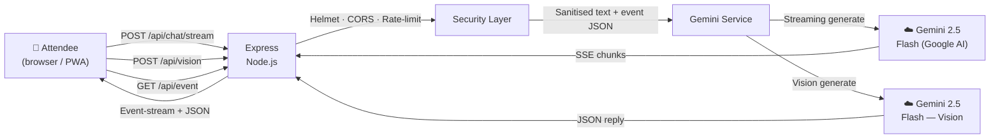

# EventAI Concierge

> A multi-modal AI concierge that helps attendees *live* a physical event — grounded in venue data, streamed from Gemini 2.5 Flash, with voice, vision, an interactive floor map, and a personal agenda builder.

**Challenge:** Physical Event Experience
**Model:** Gemini 2.5 Flash (text streaming + function-ready JSON) and Gemini 2.5 Flash Vision (image analysis)

---

## 🎯 Why this wins

Most event apps are glorified PDFs of a schedule. Attendees at a busy venue need fast, hands-busy, context-aware help: *"where do I go now?"*, *"what's that booth I'm looking at?"*, *"which track fits me?"*

EventAI Concierge answers all three with a single Gemini-powered surface:

1. **Streaming chat**, so answers appear as the model thinks — no dead-air loading.
2. **Voice in + TTS out**, so attendees can ask without stopping walking.
3. **Gemini Vision**, so pointing a phone at a booth, sign, or map gives instant context.
4. **Interactive SVG floor map** that *lights up* whenever the AI references a room.
5. **Personal agenda builder** with an AI "build me a schedule" button and `.ics` export into any calendar app.
6. **PWA-installable** and **offline-tolerant** — the shell works even when venue Wi-Fi drops.

All of it grounded in a structured event dataset so the model can never hallucinate a room number that doesn't exist.

---

## 🧠 Architecture



The server is a small Express app; all the intelligence is in the prompt + the Gemini service.

### Request flow (text chat)

1. User types, speaks, or taps a chip.
2. Frontend opens `POST /api/chat/stream` (Server-Sent Events).
3. Express validates (≤ 500 chars), sanitises HTML, rate-limits (30 req/min/IP).
4. `streamGemini()` attaches a system prompt that embeds the full event JSON and yields chunks.
5. Each chunk is written as an `event: chunk` SSE frame; the client appends it to the bubble with a typing caret.
6. A trailing `<CARDS>…</CARDS>` marker (part of the prompt contract) is parsed out and rendered as rich cards + map highlights.

### Request flow (vision)

1. User snaps or uploads a photo (≤ 5 MB, JPEG/PNG/WebP/HEIC).
2. Frontend reads as base-64 data URL, `POST /api/vision`.
3. Server decodes the data URL, validates the MIME, and calls `askGeminiVision()` with the image + event grounding.
4. Gemini identifies the subject, matches it to the event (booth, session poster, map panel, plate), and responds with text + the same `<CARDS>` contract.

---

## ✨ Features

| Feature | Detail |
|---|---|
| 💬 **Streaming chat** | SSE from `@google/generative-ai` → word-by-word typing UI |
| 🎙️ **Voice input** | Hold-to-talk via Web Speech API; transcript auto-sends |
| 🔊 **TTS replies** | Toggleable `speechSynthesis` playback — hands-free mode |
| 📸 **Photo search** | Upload / camera → Gemini Vision → booth, session, or food match |
| 🗺️ **Interactive map** | SVG floor plans (3 floors); rooms the AI mentions light up |
| 📅 **Personal agenda** | Star sessions, filter by track, AI-recommended schedule |
| ⬇️ **.ics export** | One-click import into Google / Apple / Outlook calendars |
| ♿ **Accessibility first** | Wheelchair routes, sign-language, quiet zones surfaced proactively |
| 📱 **Installable PWA** | `manifest.webmanifest` + service-worker cache for offline shell |
| 🔒 **Security hardened** | Helmet CSP, same-origin CORS, IP rate-limit, body/image size caps |

---

## 🧪 Try it

### Sample questions

- "What's on after lunch?" → streamed answer + rich session cards you can tap
- "How do I get to Room 301 in a wheelchair?" → step-by-step grounded in the accessible-route data
- "Which booths are AI-related?" → booth cards with perks + "Show on map" buttons
- "Where's the nearest quiet zone to Room 202?" → proximity reasoning from the map coordinates
- *Snap a photo of any booth sign* → vision call identifies it and surfaces perks + location

### Quick-start chips on the landing hero cover the most common queries.

---

## 🚀 Local Setup

```bash
# 1. Clone
git clone https://github.com/Ritesh-Root/event-ai-concierge.git
cd event-ai-concierge

# 2. Install
npm install

# 3. Configure
cp .env.example .env
# Edit .env → GEMINI_API_KEY=<your key from https://aistudio.google.com/>

# 4. Test
npm test

# 5. Run
npm start          # http://localhost:8080
```

### Scripts

| Command | Description |
|---|---|
| `npm start` | Production server |
| `npm run dev` | Hot-reload with `node --watch` |
| `npm test` | Jest + coverage (thresholds: 70/60/70/70) |
| `npm run lint` | ESLint |
| `npm run format` | Prettier |

### Docker

```bash
docker build -t event-ai-concierge .
docker run -p 8080:8080 -e GEMINI_API_KEY=... event-ai-concierge
```

---

## 🤖 Google AI Integration

| Aspect | Detail |
|---|---|
| **Models** | `gemini-2.5-flash-lite` (text/streaming), `gemini-2.5-flash` (vision) |
| **SDK** | `@google/generative-ai` — official Google Node SDK |
| **Streaming** | `model.generateContentStream()` piped through Express SSE — low TTFB |
| **Vision** | `inlineData` parts for base-64 image; same grounding prompt as text |
| **Structured output** | Prompt contract emits a hidden `<CARDS>{...}</CARDS>` marker parsed by the UI into typed cards (session / booth / room) — no client-side NLP needed |
| **Grounding** | Full event JSON is injected as `systemInstruction`; rules forbid inventing rooms / booths |
| **Resilience** | Retry-with-backoff on 429 / 5xx; auth errors short-circuit |

---

## 📁 Project Structure

```
event-ai-concierge/
├── public/                # Static frontend (vanilla JS + CSS)
│   ├── index.html         # 3-tab shell (Chat / Map / Agenda)
│   ├── styles.css         # Dark-glass design system, fully responsive
│   ├── app.js             # Streaming, voice, TTS, map, agenda, PWA
│   ├── manifest.webmanifest
│   ├── sw.js              # Service worker — offline shell
│   └── icon.svg
├── src/
│   ├── routes/chat.js     # /api/chat, /chat/stream, /vision, /event
│   ├── services/gemini.js # Gemini SDK wrappers (text, stream, vision)
│   ├── middleware/
│   │   ├── rateLimit.js
│   │   └── security.js    # Helmet CSP + same-origin CORS
│   └── utils/
│       ├── eventData.js   # InnovateSphere 2026 dataset w/ map coords
│       └── prompts.js     # System prompts (text + vision)
├── tests/                 # Jest + Supertest (chat, stream, vision, security, gemini)
├── server.js              # Express entrypoint, graceful shutdown
└── Dockerfile
```

---

## ♿ Accessibility (WCAG AA)

- Semantic HTML5 landmarks, skip-to-content link, visible focus rings (3px solid)
- `aria-live="polite"` on chat transcript; `role="alert"` on errors
- Keyboard-only navigation (Tab, Enter to send, `.tab` role radio group)
- Contrast ≥ 4.5:1 on all text + colour-blind-safe accent palette
- `@media (prefers-reduced-motion: reduce)` disables every animation
- Voice input + TTS playback as alternative interaction modes
- Grounded prompt surfaces wheelchair routes, hearing loops, and quiet zones proactively

---

## 🔒 Security

- **Helmet** — CSP, HSTS, nosniff, X-Frame-Options, no X-Powered-By
- **CORS** — same-origin only; external origins rejected
- **Rate limit** — 30 req/min/IP on every AI endpoint
- **Input validation** — type check, 500-char cap, HTML-tag strip
- **Image validation** — MIME allow-list, 5 MB cap, base-64 integrity check
- **Body size** — 7 MB (covers encoded 5 MB image + JSON overhead)
- **No secrets in client** — API key server-side only
- **Graceful shutdown** — SIGTERM/SIGINT drains connections

---

## 📜 License

MIT © Sunmount Solutions
