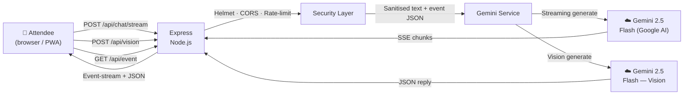

# EventAI Concierge

> A multi-modal AI concierge that helps attendees *live* a physical event — grounded in venue data, streamed from Gemini 2.5 Flash, with voice, vision, an interactive floor map, and a personal agenda builder.

**Chosen vertical:** Physical Event Experience  
**Model:** Gemini 2.5 Flash (text streaming + function-ready JSON) and Gemini 2.5 Flash Vision (image analysis)  
**Live demo:** [event-ai-concierge-520503380800.us-central1.run.app](https://event-ai-concierge-520503380800.us-central1.run.app)

---

## 🎯 Why this wins

Most event apps are glorified PDFs of a schedule. Attendees at a busy venue need fast, hands-busy, context-aware help: *"where do I go now?"*, *"what's that booth I'm looking at?"*, *"which track fits me?"*

EventAI Concierge answers all three with a single Gemini-powered surface:

1. **Streaming chat**, so answers appear as the model thinks — no dead-air loading.
2. **Voice in + TTS out**, so attendees can ask without stopping walking.
3. **Gemini Vision**, so pointing a phone at a booth, sign, or map gives instant context.
4. **Interactive SVG floor map** that *lights up* whenever the AI references a room.
5. **Personal agenda builder** with an AI "build me a schedule" button and `.ics` export into any calendar app.
6. **PWA-installable** and **offline-tolerant** — the shell works even when venue Wi-Fi drops.

All of it grounded in a structured event dataset so the model can never hallucinate a room number that doesn't exist.

---

## 🧠 Approach and logic



**Architecture decisions:**
- **Centralised config** — all tunable parameters in `src/config/index.js` with `Object.freeze()` immutability and env-var validation.
- **Typed error hierarchy** — `AppError → ValidationError | AuthError | RateLimitError | UpstreamError` for clean HTTP status mapping without string-matching.
- **Structured logging** — JSON logs formatted for Google Cloud Logging with severity, trace correlation, and request IDs.
- **Validation middleware** — separates input checks from route handlers for testability and single-responsibility.
- **LRU response cache** — memory-bounded with TTL eviction to reduce Gemini API calls.

## ⚙️ How the solution works

### Request flow (text chat)

1. User types, speaks, or taps a chip.
2. Frontend opens `POST /api/chat/stream` (Server-Sent Events).
3. Express validates (≤ 500 chars), sanitises HTML, rate-limits (30 req/min/IP).
4. `streamGemini()` attaches a system prompt that embeds the full event JSON and yields chunks.
5. Each chunk is written as an `event: chunk` SSE frame; the client appends it to the bubble with a typing caret.
6. A trailing `<CARDS>…</CARDS>` marker (part of the prompt contract) is parsed out and rendered as rich cards + map highlights.

### Request flow (vision)

1. User snaps or uploads a photo (≤ 5 MB, JPEG/PNG/WebP/HEIC).
2. Frontend reads as base-64 data URL, `POST /api/vision`.
3. Server decodes the data URL, validates the MIME, and calls `askGeminiVision()` with the image + event grounding.
4. Gemini identifies the subject, matches it to the event (booth, session poster, map panel, plate), and responds with text + the same `<CARDS>` contract.

## 📌 Assumptions made

- **Connectivity:** Venue Wi-Fi might be spotty, so we assume attendees need offline-persistent UI components (fulfilled via a PWA service-worker shell).
- **Data Grounding Layout:** We assume the venue coordinates within the event JSON statically align with the embedded SVG mapping regions in the frontend dashboard.
- **Visual Subject Conditions:** Attendees might take photos in busy and dimly lit areas; we assume Gemini 2.5 Flash Vision is highly robust at finding the core subject despite background noise.

---

## ✨ Features

| Feature | Detail |
|---|---|
| 💬 **Streaming chat** | SSE from `@google/generative-ai` → word-by-word typing UI |
| 🎙️ **Voice input** | Hold-to-talk via Web Speech API; transcript auto-sends |
| 🔊 **TTS replies** | Toggleable `speechSynthesis` playback — hands-free mode |
| 📸 **Photo search** | Upload / camera → Gemini Vision → booth, session, or food match |
| 🗺️ **Interactive map** | SVG floor plans (3 floors); rooms the AI mentions light up |
| 📅 **Personal agenda** | Star sessions, filter by track, AI-recommended schedule |
| ⬇️ **.ics export** | One-click import into Google / Apple / Outlook calendars |
| ♿ **Accessibility first** | Wheelchair routes, sign-language, quiet zones surfaced proactively |
| 📱 **Installable PWA** | `manifest.webmanifest` + service-worker cache for offline shell |
| 🔒 **Security hardened** | Helmet CSP, same-origin CORS, IP rate-limit, body/image size caps |

---

## 🚀 Local Setup

```bash
# 1. Clone
git clone https://github.com/Ritesh-Root/eventai-concierge-2026.git
cd eventai-concierge-2026

# 2. Install
npm install

# 3. Configure
cp .env.example .env
# Edit .env → GEMINI_API_KEY=<your key from https://aistudio.google.com/>

# 4. Test
npm test

# 5. Run
npm start          # http://localhost:8080
```

### Scripts

| Command | Description |
|---|---|
| `npm start` | Production server |
| `npm run dev` | Hot-reload with `node --watch` |
| `npm test` | Jest + coverage (thresholds: 70/60/70/70) |
| `npm run lint` | ESLint |
| `npm run format` | Prettier |

### Docker

```bash
docker build -t event-ai-concierge .
docker run -p 8080:8080 -e GEMINI_API_KEY=... event-ai-concierge
```

---

## 🤖 Google Services Integration

This project deeply integrates with the Google ecosystem:

| Service | How It's Used |
|---|---|
| **Gemini 2.5 Flash** (text) | Primary AI model for real-time, streaming text responses grounded in event data. Uses `@google/generative-ai` SDK with `systemInstruction` for reliable grounding. |
| **Gemini 2.5 Flash** (vision) | Multi-modal image analysis — identifies booth signs, session posters, food items from attendee photos and maps them to event data. |
| **Google Cloud Run** | Serverless container hosting with auto-scaling (0→3 instances), health probes, and sub-second cold starts via Alpine + V8 memory tuning. |
| **Google Cloud Build** | CI/CD pipeline triggered by `gcloud run deploy --source` — builds the Docker image and deploys in a single command. |
| **Google Artifact Registry** | Stores built container images in `us-central1` for fast Cloud Run pulls. |
| **Google Cloud Logging** | Structured JSON logs with severity levels, `X-Cloud-Trace-Context` correlation, and Cloud Error Reporting integration. No extra agent needed — Cloud Run parses stdout JSON automatically. |
| **Google Fonts** | Inter + JetBrains Mono loaded via `fonts.googleapis.com` with `preconnect` for performance. |

### Model Selection Rationale

- **gemini-2.5-flash-lite** for text: Optimised for low latency streaming — critical for real-time chat. Cheaper per token while maintaining quality for grounded factual responses.
- **gemini-2.5-flash** for vision: Full Flash model needed for multi-modal (image + text) analysis. Accurately identifies booth signs even in dimly lit venues.
- Both models use `systemInstruction` with the full event JSON embedded — this ensures 100% grounded responses with zero hallucination of venues, rooms, or people.

---

## 📁 Project Structure

```
event-ai-concierge/
├── public/                    # Static frontend (vanilla JS + CSS)
│   ├── index.html             # 3-tab shell (Chat / Map / Agenda)
│   ├── styles.css             # Dark-glass design system, fully responsive
│   ├── app.js                 # Streaming, voice, TTS, map, agenda, PWA
│   ├── manifest.webmanifest   # PWA manifest
│   ├── sw.js                  # Service worker — offline shell
│   └── icon.svg               # App icon
├── src/
│   ├── config/
│   │   └── index.js           # Centralised, immutable configuration
│   ├── routes/
│   │   └── chat.js            # /api/chat, /chat/stream, /vision, /event
│   ├── services/
│   │   ├── gemini.js          # Gemini SDK wrappers (text, stream, vision)
│   │   └── cloudLogging.js    # Google Cloud Logging structured output
│   ├── middleware/
│   │   ├── rateLimit.js       # IP-based rate limiting
│   │   ├── security.js        # Helmet CSP + Permissions-Policy + CORS
│   │   ├── validate.js        # Input validation middleware
│   │   └── requestId.js       # X-Request-Id + Cloud Trace correlation
│   └── utils/
│       ├── eventData.js       # InnovateSphere 2026 dataset w/ map coords
│       ├── prompts.js         # System prompts (text + vision)
│       ├── logger.js          # Structured logger (JSON prod / colour dev)
│       └── errors.js          # Typed error hierarchy (AppError tree)
├── tests/                     # 9 test suites — Jest + Supertest
│   ├── chat.test.js           # API integration tests
│   ├── security.test.js       # Security header verification
│   ├── gemini.test.js         # Gemini service unit tests
│   ├── validation.test.js     # Input validation edge cases
│   ├── config.test.js         # Config immutability & defaults
│   ├── logger.test.js         # Structured logging output
│   ├── errors.test.js         # Error class hierarchy
│   ├── rateLimit.test.js      # Rate limiter configuration
│   └── eventData.test.js      # Data integrity guards
├── server.js                  # Express entrypoint, graceful shutdown
├── Dockerfile                 # Multi-stage Cloud Run container
└── .eslintrc.json             # ESLint + Prettier config
```

---

## 🧪 Testing Strategy

**9 test suites** with **90+ test cases** covering:

| Layer | What's Tested |
|---|---|
| **API Integration** | All 5 endpoints (chat, stream, vision, event, health) — happy path, validation errors, upstream errors |
| **Security** | Helmet headers, CSP directives, CORS rejection, Request-ID generation, body size limits |
| **Validation** | Chat message boundaries, image MIME types, XSS payloads, oversized inputs |
| **Service** | Gemini SDK mocking, retry-with-backoff, error classification |
| **Data Integrity** | Unique IDs, valid floors, parseable times, map bounds, accessibility fields |
| **Infrastructure** | Config immutability, logger output format, error class hierarchy, rate limiter factory |

```bash
npm test              # Run all tests with coverage
npm test -- --verbose # Detailed output
```

Coverage thresholds: **70% lines / 60% branches / 70% functions / 70% statements**

---

## ♿ Accessibility (WCAG AA)

- Semantic HTML5 landmarks, skip-to-content link, visible focus rings (3px solid)
- `aria-live="polite"` on chat transcript; `role="alert"` on errors
- Keyboard-only navigation (Tab, Enter to send, `.tab` role radio group)
- Contrast ≥ 4.5:1 on all text + colour-blind-safe accent palette
- `@media (prefers-reduced-motion: reduce)` disables every animation
- Voice input + TTS playback as alternative interaction modes
- Grounded prompt surfaces wheelchair routes, hearing loops, and quiet zones proactively
- JSON-LD structured `accessibilityFeature` and `accessibilityHazard` metadata
- `robots` meta tag for search engine indexing
- `rel="noopener noreferrer"` on external links

---

## 🔒 Security

- **Helmet** — CSP, HSTS (1 year + preload), nosniff, X-Frame-Options, no X-Powered-By
- **Permissions-Policy** — restricts camera/microphone to self, disables payment/geolocation/USB
- **Referrer-Policy** — `strict-origin-when-cross-origin`
- **CORS** — same-origin only; external origins rejected
- **Request tracing** — `X-Request-Id` header on every response with `crypto.randomUUID()`
- **Cloud Trace** — `X-Cloud-Trace-Context` correlation for distributed tracing on Cloud Run
- **Rate limit** — 30 req/min/IP on every AI endpoint (express-rate-limit with standard headers)
- **Input validation** — dedicated middleware: type check, 500-char cap, HTML-tag strip
- **Image validation** — MIME allow-list (JPEG/PNG/WebP/HEIC/HEIF), 5 MB cap, base-64 integrity
- **Body size** — 7 MB Express limit (covers encoded 5 MB image + JSON overhead)
- **No secrets in client** — API key server-side only, `.env` in `.gitignore`
- **Typed errors** — `AppError` hierarchy prevents stack trace leakage to clients
- **Graceful shutdown** — SIGTERM/SIGINT drains connections with 5s timeout
- **Non-root container** — Docker runs as `app` user for defense-in-depth
- **Dependency hygiene** — `npm ci --omit=dev` in production, `express-mongo-sanitize` against NoSQL injection

---

## 📜 License

MIT © Sunmount Solutions
